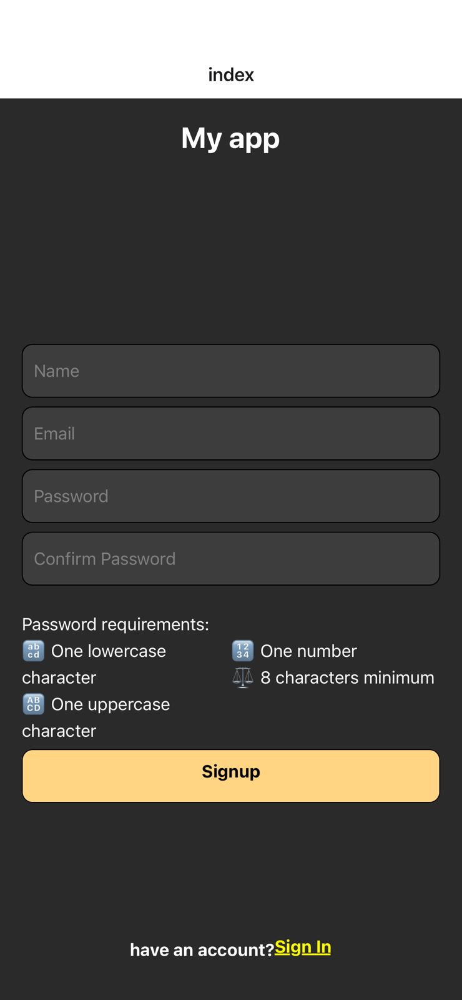
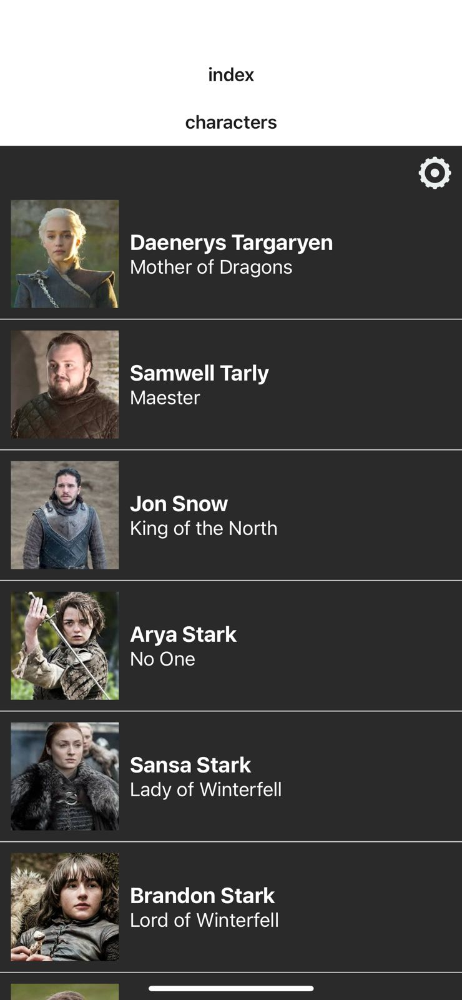
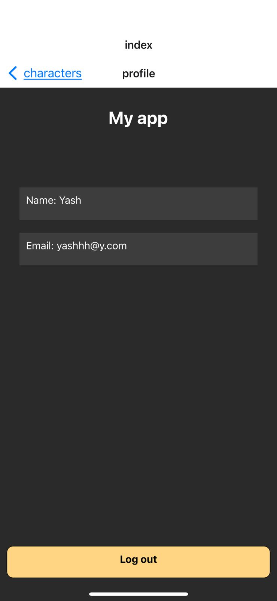

<a name="readme-top"></a>

<div align="center">
  <h1>CodeScale Assignmnet</h1>
  <h2>📖 GOT Characters App</h2>
</div>


<!-- TABLE OF CONTENTS -->

# 📗 Table of Contents

- [📖 About the Project](#about-project)

  - [🛠 Built With](#built-with)
    - [Key Features](#key-features)
  <!-- - [🚀 Live Demo](#live-demo) -->
- [💻 Getting Started](#getting-started)
  - [Prerequisites](#prerequisites)
  - [Setup](#setup)
- [👥 Authors](#authors)
- [🔭 Future Features](#future-features)
- [🤝 Contributing](#contributing)
- [⭐️ Show your support](#support)
- [🙏 Acknowledgements](#acknowledgements)
- [:question: FAQ](#faq)
- [📝 License](#license)

<!-- PROJECT DESCRIPTION -->

# 📖 GOT Characters <a name="about-project"></a>

> This React Native application, "GOT Characters App," is a mobile application that provides a seamless experience for users to explore characters from the popular television series "Game of Thrones." The app integrates Firebase authentication and a Firebase database to enhance user experience and ensure secure sign-up and sign-in processes.

## [Link to the Demo](https://drive.google.com/file/d/19NMkbEBlCajmefoSIeJvkVbDtIeH61u5/view?usp=drive_link)

<p align="center">
  
  
  
</p>
<be>
  
## The learning objective of this project are

- Create react Native app
- Use Firebase authentication
- Fetch data from the API
- Text to voice library configuration

## Built With

-expo react native

<!-- Features -->

### Key Features <a name="key-features"></a>

- **Sign In**
- **Sign Up**
- **Show Characters**

## Getting Started

To get a local copy up and running follow these simple example steps.


### Setup


- ```https://github.com/yashodhicy/CodeScale-Assignment.git```

- ```cd CodeScale-Assignment```


### Running The App Locally

- Install `npm install`
- Run `npm run start`

Install the Expo Go app on your iOS or Android phone and connect to the same wireless network as your computer. On Android, use the Expo Go app to scan the QR code from your terminal to open your project. On iOS, use the built-in QR code scanner of the default iOS Camera app. 

## Authors

👤 : **Yashodhi Chathurangi**

- GitHub: [@githubhandle](https://github.com/yashodhicy)
- Twitter: [@twitterhandle](https://twitter.com/Yashichathucy)
- LinkedIn: [LinkedIn](https://www.linkedin.com/in/yashodhichathurangi/)

## 🤝 Contributing

Contributions, issues, and feature requests are welcome!

Feel free to check the [issues page](https://github.com/yashodhicy/CodeScale-Assignment/issues).

## Show your support

Give a ⭐️ if you like this project!

## Acknowledgments

- Hats off to [CodeScale](codescale.lk) for giving the valuable learning experience and the awesome template that was used. ✨


## Technical Documentation

### Expo Router Example

Use [`expo-router`](https://expo.github.io/router) to build native navigation using files in the `app/` directory.

## 🚀 How to use

```sh
npx create-expo-app -e with-router
```

### 📝 Notes

- [Expo Router: Docs](https://expo.github.io/router)
- [Expo Router: Repo](https://github.com/expo/router)
